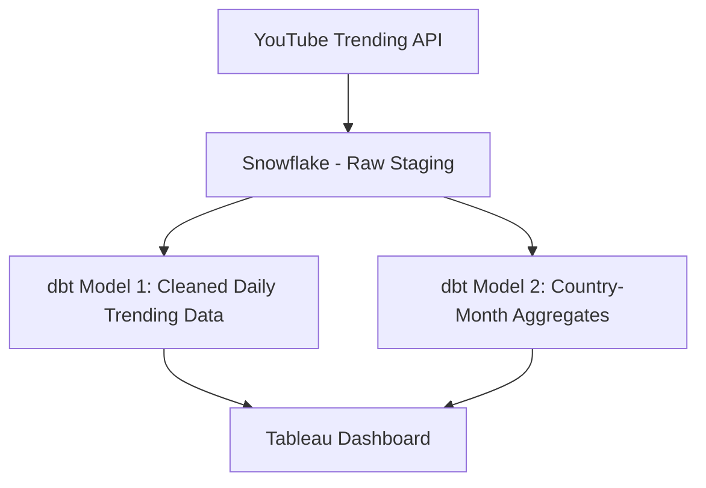

# YouTube Trending Analytics Dashboard

## 🎯 Project Overview

This project builds an end-to-end data pipeline for analyzing YouTube trending video patterns across countries and time. Leveraging a combination of modern data warehousing tools, the pipeline extracts raw data from an API source, stages and transforms it in Snowflake using dbt, and visualizes key insights with Tableau.

This work was completed as the final project for 
**MLDS 430: Data Warehousing** at Northwestern University

Kaggle：https://www.kaggle.com/datasets/datasnaek/youtube-new?resource=download

## 🧰 Tools & Technologies

- **API Source** – YouTube Trending Dataset (JSON format via HTTP request)
- **Snowflake** – Data warehouse used for staging and analytics
- **dbt (data build tool)** – Transformations and model creation
- **Tableau** – Final interactive dashboard with visuals
- **GitHub** – Version control and collaboration
- *(Optional: Airflow - not used in this version)*

## 🔗 Pipeline Architecture



🏗️ dbt Models

stg_youtube_daily.sql

Cleanses and standardizes the raw daily records

Handles nulls, inconsistent country codes, and date formats

agg_country_month.sql

Aggregates counts of trending videos by country and month

Enables heatmaps and stacked bar charts in Tableau

Each model is documented using dbt's built-in schema.yml and includes tests for non-null country, trending date, and row count thresholds.

📊 Tableau Dashboard

The dashboard includes two main visual components:

Monthly Country Distribution (Stacked Bar Chart)

Shows volume of trending videos per country by month

Heatmap of Trends (Country vs Month-Year)

Color-coded view of activity intensity over time

Screenshot previews are available in the /images folder.

## 🛠️ Reproduce this Project

1. Clone the repo
2. Set up Snowflake credentials (via `.env` or `profiles.yml`)
3. Run `python api_to_snowflake.py` to extract + load
4. Run `dbt run` from `youtube_dbt_project/`
5. Open Tableau dashboard with `YouTube Trend.twbx`

📝 Project Folder Structure
```plaintext
📁 NUMLDS---MLDS-430-wuc6784
│
├── dbt_project/
│   ├── models/
│   │   ├── stg_youtube_daily.sql
│   │   ├── agg_country_month.sql
│   └── schema.yml
│
├── tableau/
│   └── YouTube_Trending.twb
│
├── scripts/
│   └── api_to_snowflake.py
│
├── README.md
└── images/
    └── dashboard_screenshots.png


